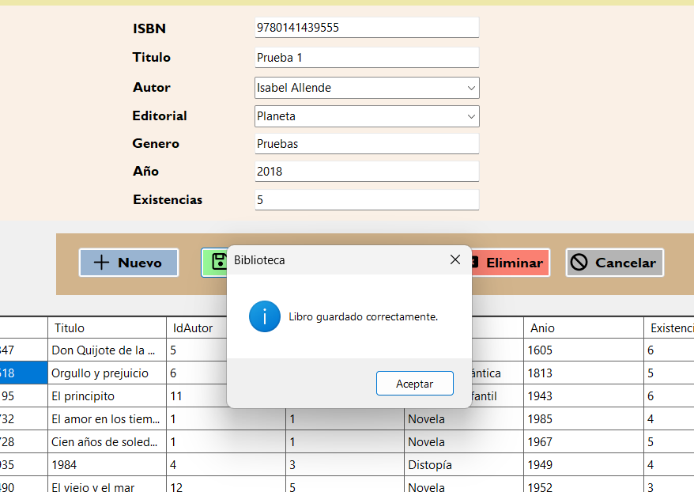
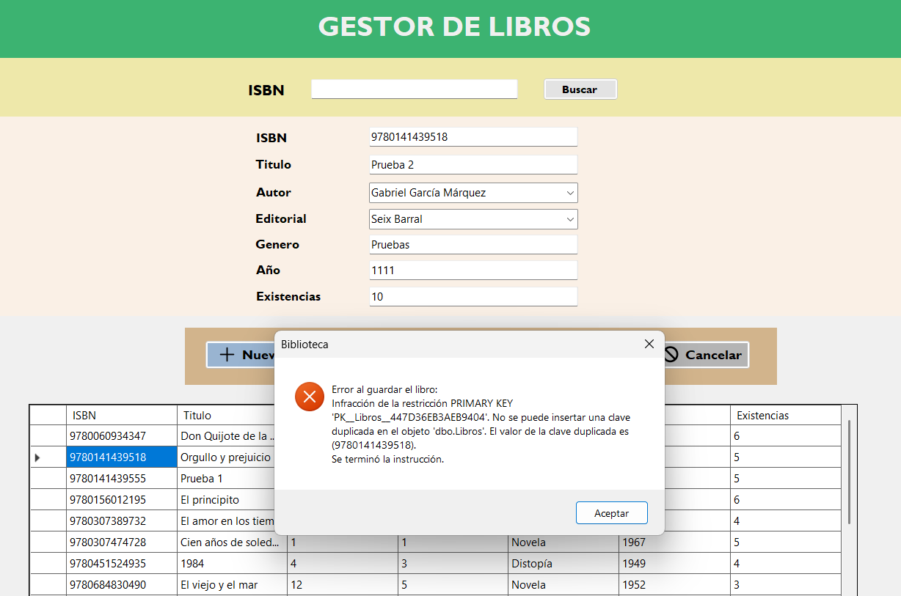
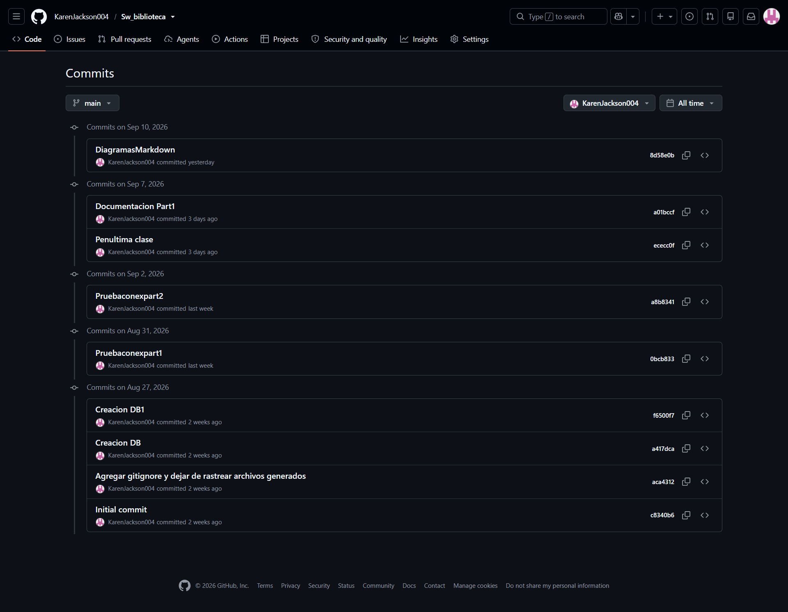

# ACA -- Programación Avanzada

# Sistema de Gestión de Biblioteca

------------------------------------------------------------------------

## PORTADA

**\[KAREN NATALIA CASAS CARDOZO\]**

**\[Ingenieria de sitemas / 53304\]**

### ACA -- Programación Avanzada

### Sistema de Gestión de Biblioteca

**Presentado por:**\
\[Karen Natalia Casas Cardozo\]

**Docente:**\
\[Veronica Castro Manur\]

**Fecha:**\
\[Bogotá D.C, Septiembre 13, 2026\]

------------------------------------------------------------------------

# CONTRAPORTADA

**Sistema de Gestión de Biblioteca**

Proyecto desarrollado como evidencia del curso de **Programación
Avanzada**, aplicando Programación Orientada a Objetos, base de datos
relacional, arquitectura por capas, operaciones CRUD, validaciones,
manejo de excepciones y conexión con SQL Server.

**Estudiante(s):** \[Karen Natalia Casas Cardozo\]\
**Programa:** \[Ingeniería de sistemas\]\
**Grupo:** \[53304\]\
**Docente:** \[Veronica Castro Manur\]\
**Institución:** \[Corporacion Unificada Nacional de educación superior\]\
**Año:** \[2026\]

------------------------------------------------------------------------

# TABLA DE CONTENIDO

> **Nota:** Actualizar esta sección al finalizar el documento, de
> acuerdo con la numeración real de las páginas.

1.  Introducción
2.  Objetivos
    -   2.1 Objetivo general
    -   2.2 Objetivos específicos
3.  Planteamiento del problema
4.  Análisis de requerimientos
5.  Casos de uso
6.  Diagrama de clases
7.  Modelo entidad-relación
8.  Diccionario de datos
9.  Arquitectura del sistema
10. Explicación de los módulos desarrollados
11. Capturas de pantalla del sistema
12. Pruebas de funcionamiento
13. Conclusiones
14. Recomendaciones
15. Referencias bibliográficas

------------------------------------------------------------------------

# 1. INTRODUCCIÓN

Esta documentación corresponde al desarrollo de un proyecto de programación para una biblioteca de una institución educativa, con el fin de facilitar la gestión administrativa ya que esta se desarrollaba de forma manueal, se creo un software de escritorio y así tener una gestion centralizada y mas eficiente. 

En este programa buscamos una manipulación de los datos e informacion consistente, como lo son; registro de usuarios, gestion de libros, prestamos, editoriales, etc.

El sistema fue desarrollado utilizando **\[C# / .NET / Windows Forms /
SQL Server / otras tecnologías utilizadas\]**, aplicando principios de
Programación Orientada a Objetos y una arquitectura por capas.

------------------------------------------------------------------------

# 2. OBJETIVOS

## 2.1 Objetivo general

Desarrollar un Sistema de Gestión de Biblioteca que permita administrar usuarios, libros, prestamos, etc, utilizando Programación Orientada a
Objetos, una base de datos relacional y una arquitectura por capas.


## 2.2 Objetivos específicos

-   Diseñar e implementar una aplicación de escritorio para la gestión
    de una biblioteca escolar.
-   Aplicar principios de Programación Orientada a Objetos.
-   Diseñar e implementar una base de datos relacional en SQL Server.
-   Implementar operaciones CRUD para las entidades principales.
-   Implementar validaciones de datos.
-   Implementar manejo de excepciones.
-   Aplicar una arquitectura por capas.
-   Implementar consultas que faciliten la administración de la
    biblioteca.
-   Utilizar Git y GitHub para el control de versiones.
-   Documentar técnica y funcionalmente el proyecto.

------------------------------------------------------------------------

# 3. PLANTEAMIENTO DEL PROBLEMA

## 3.1 Descripción del problema


La biblioteca actualmente presenta dificultades para administrar de
manera organizada la información relacionada con los libros, autores,
usuarios y préstamos. El manejo manual de esta información puede generar
errores, pérdida de información y dificultades para conocer la
disponibilidad de los libros.

Por esta razón, se propone desarrollar una aplicación que permita
centralizar y administrar la información de la biblioteca de manera
organizada y eficiente.


## 3.2 Justificación

La importancia de este programa es crucial ya que ayudaria a la institución educativa s tener un sistemas centralizado de base de datos, ademas, la gestión se facilitaria de una gran forma y ya no habrian duplicidad y errores en la información.

## 3.3 Alcance

El sistema permitirá:

-   Gestionar libros.
-   Gestionar autores.
-   Gestionar usuarios.
-   Registrar préstamos.
-   Registrar devoluciones.
-   Consultar disponibilidad.
-   Consultar historial de préstamos.
-   \[Agregar otras funcionalidades implementadas\].

------------------------------------------------------------------------

# 4. ANÁLISIS DE REQUERIMIENTOS

## 4.1 Descripción general

El Sistema de Gestión de Biblioteca permitirá administrar la información
relacionada con \[entidades principales\] y controlar los procesos de
\[préstamos, devoluciones, consultas, etc.\].

## 4.2 Actores del sistema

  Actor                               Descripción
  ----------------------------------- -----------------------------------
  Bibliotecario / Administrador       \[Manipular la información de usuarios, libros, prestamos, autores, editoriales y reportes en base a los requerimientos que se esten necesitando y organizando\]
  -----------------------------------------------------------------------

## 4.3 Requerimientos funcionales

  -----------------------------------------------------------------------
  Código                  Requerimiento           Descripción
  ----------------------- ----------------------- -----------------------
  RF01                    Gestionar libros        Registrar, consultar,
                                                  actualizar, eliminar y
                                                  buscar libros.

  RF02                    Gestionar autores       Registrar, consultar,
                                                  actualizar y eliminar
                                                  autores.

  RF03                    Gestionar categorías    Registrar, consultar,
                                                  actualizar y eliminar
                                                  categorías.

  RF04                    Gestionar usuarios      Registrar, consultar,
                                                  actualizar y eliminar
                                                  usuarios.

  RF05                    Registrar préstamos     Registrar préstamos y
                                                  actualizar la
                                                  disponibilidad de los
                                                  libros.

  RF06                    Registrar devoluciones  Registrar devoluciones,
                                                  calcular retrasos y
                                                  multa cuando aplique.

  RF07                    Realizar consultas      Consultar libros
                                                  disponibles, libros
                                                  prestados, historial y
                                                  usuarios con préstamos
                                                  activos.

  RF08                    \[Otro requerimiento\]  \[Descripción.\]
  -----------------------------------------------------------------------

## 4.4 Requerimientos no funcionales

  -----------------------------------------------------------------------
  Código                  Requerimiento           Descripción
  ----------------------- ----------------------- -----------------------
  RNF01                   Usabilidad              La interfaz debe ser
                                                  clara, sencilla y fácil
                                                  de utilizar.

  RNF02                   Validación              El sistema debe validar
                                                  la información
                                                  ingresada por el
                                                  usuario.

  RNF03                   Mantenibilidad          El código debe estar
                                                  organizado y
                                                  documentado.

  RNF04                   Arquitectura            El sistema debe
                                                  utilizar una
                                                  arquitectura por capas.

  RNF05                   Manejo de excepciones   Las operaciones deben
                                                  manejar errores de
                                                  forma controlada.

  RNF06                   Integridad de datos     La información debe
                                                  mantenerse consistente
                                                  en la base de datos.

  RNF07                   Consultas               Las consultas a la base
                          parametrizadas          de datos deben utilizar
                                                  parámetros.

## 4.5 Reglas de negocio

### RN01 -- Código único del libro

No se permitirá registrar dos libros con el mismo código.

### RN02 -- Datos obligatorios

No se permitirá almacenar registros con campos obligatorios vacíos.

### RN03 -- Usuario existente

No se podrá registrar un préstamo para un usuario inexistente.

### RN04 -- Libro existente

No se podrá registrar un préstamo para un libro inexistente.

### RN05 -- Disponibilidad

No se podrá prestar un libro cuando no existan ejemplares disponibles.

### RN06 -- Actualización de disponibilidad

Al registrar un préstamo, la disponibilidad del libro deberá
actualizarse.

### RN07 -- Devolución

Al registrar una devolución, la disponibilidad deberá actualizarse
nuevamente.

### RN08 -- Multa

La multa se calculará únicamente cuando exista retraso en la devolución.

------------------------------------------------------------------------

# 5. CASOS DE USO

## 5.1 Descripción

El bibliotecario o administradores, pueden interactuar con el sistema por medio de la interfaz GUI, ya que esta es guiada de una manera muy facil de usar, allí podran hcaer consultas, editar, eliminar o actualizar información acerca de la biblioteca y sus usuarios.

## 5.2 Diagrama de casos de uso

[Diagrama](Imagenes/Diagrama%20De%20Casos%20De%20Uso.png)

## 5.3 Descripción de casos de uso

### CU01 -- Gestionar libros

**Actor principal:** Bibliotecario / Administrador

**Descripción:** Permite registrar, consultar, actualizar, eliminar y
buscar libros.

**Precondiciones:** - El usuario debe tener acceso al sistema.

**Flujo principal:**

 1. El actor ingresa al módulo de libros. 2. El
sistema muestra los libros registrados. 3. El actor selecciona la
operación que desea realizar. 4. El sistema procesa la solicitud. 5. El
sistema muestra el resultado.
------------------------------------------------------------------------

### CU02 -- Registrar préstamo

**Actor principal:** Bibliotecario / Administrador

**Descripción:** Permite registrar el préstamo de uno o varios libros a
un usuario.

**Precondiciones:** - El usuario debe existir. - El libro debe
existir. - Debe existir disponibilidad.

**Flujo principal:** 1. Seleccionar usuario. 2. Seleccionar libro. 3.
Verificar disponibilidad. 4. Registrar préstamo. 5. Actualizar
disponibilidad. 6. Mostrar confirmación.

**Flujos alternativos:** - Usuario inexistente. - Libro inexistente. -
Libro sin disponibilidad.

**Postcondiciones:** - El préstamo queda registrado. - La disponibilidad
del libro queda actualizada.

------------------------------------------------------------------------

### CU03 -- Registrar devolución

**Actor principal:** Bibliotecario / Administrador

**Descripción:** Permite registrar la devolución de un libro prestado.

**Precondiciones:** - Debe existir un préstamo activo.

**Flujo principal:** 1. Seleccionar el préstamo. 2. Registrar la
devolución. 3. Calcular días de retraso. 4. Calcular multa cuando
corresponda. 5. Actualizar disponibilidad. 6. Actualizar el estado del
préstamo. 7. Mostrar confirmación.

**Postcondiciones:** - La devolución queda registrada. - El libro vuelve
a estar disponible según corresponda.

------------------------------------------------------------------------

# 6. DIAGRAMA DE CLASES

## 6.1 Descripción

  Clase             Responsabilidad
  ----------------- --------------------------------------------------------
  Libro             Representar y gestionar la información de los libros.
  Autor             Representar y gestionar los autores.
  Categoria         Representar las categorías de los libros.
  Usuario           Representar los usuarios de la biblioteca.
  Prestamo          Gestionar la información de los préstamos.
  DetallePrestamo   Relacionar los libros incluidos en un préstamo.
  Devolucion        Gestionar las devoluciones y calcular retrasos/multas.

## 6.2 Diagrama de clases

[Diagrama](Imagenes/Diagrama%20De%20Clases.png)

------------------------------------------------------------------------

# 7. MODELO ENTIDAD-RELACIÓN

## 7.1 Descripción

En base a este modelo podemos hacer un molde grafico de lo que seria la base de datos con sus respectivas entidades, con sus llaves primarias y llaves foraneas.

## 7.2 Diagrama entidad-relación

[Modelo entidad-relacion](Imagenes/Modelo%20entidad.png)

-   Un autor puede tener muchos libros.
-   Una categoría puede estar asociada a muchos libros.
-   Un usuario puede realizar muchos préstamos.
-   Un préstamo puede contener uno o varios detalles.
-   Un detalle de préstamo corresponde a un libro.
-   Un detalle puede generar una devolución.

------------------------------------------------------------------------

# 8. DICCIONARIO DE DATOS

## 8.1 Convenciones

  Abreviatura   Significado
  ------------- -----------------------------
  PK            Clave primaria
  FK            Clave foránea
  UQ            Campo con valor único
  NULL          Campo que puede estar vacío
  NOT NULL      Campo obligatorio

## 8.2 Tabla: Autor

  Campo             Tipo de dato   Clave   Nulo   Descripción
  ----------------- -------------- ------- ------ --------------------------------
  idAutor           INT            PK      No     Identificador único del autor.
  nombre            VARCHAR(100)   \-      No     Nombre del autor.
  apellidos         VARCHAR(100)   \-      No     Apellidos del autor.
  nacionalidad      VARCHAR(50)    \-      Sí     Nacionalidad del autor.
  fechaNacimiento   DATE           \-      Sí     Fecha de nacimiento.

## 8.3 Tabla: Categoria

  Campo         Tipo de dato   Clave   Nulo   Descripción
  ------------- -------------- ------- ------ --------------------------------------
  idCategoria   INT            PK      No     Identificador único de la categoría.
  nombre        VARCHAR(50)    UQ      No     Nombre de la categoría.
  descripcion   VARCHAR(200)   \-      Sí     Descripción de la categoría.

## 8.4 Tabla: Libro

  Campo             Tipo de dato   Clave   Nulo   Descripción
  ----------------- -------------- ------- ------ -----------------------------------
  idLibro           INT            PK      No     Identificador único del libro.
  codigo            VARCHAR(20)    UQ      No     Código único del libro.
  titulo            VARCHAR(200)   \-      No     Título del libro.
  anioPublicacion   INT            \-      Sí     Año de publicación.
  idAutor           INT            FK      No     Autor asociado al libro.
  idCategoria       INT            FK      No     Categoría del libro.
  cantidad          INT            \-      No     Cantidad de ejemplares.
  estado            VARCHAR(20)    \-      No     Estado del libro.
  sinopsis          VARCHAR(500)   \-      Sí     Descripción o sinopsis del libro.

## 8.5 Tabla: Usuario

  Campo             Tipo de dato   Clave   Nulo   Descripción
  ----------------- -------------- ------- ------ ----------------------------------
  idUsuario         INT            PK      No     Identificador único del usuario.
  documento         VARCHAR(20)    UQ      No     Número de documento.
  tipoDocumento     VARCHAR(20)    \-      No     Tipo de documento.
  nombre            VARCHAR(100)   \-      No     Nombre del usuario.
  apellidos         VARCHAR(100)   \-      No     Apellidos del usuario.
  direccion         VARCHAR(150)   \-      Sí     Dirección del usuario.
  telefono          VARCHAR(20)    \-      Sí     Teléfono de contacto.
  correo            VARCHAR(100)   \-      Sí     Correo electrónico.
  fechaNacimiento   DATE           \-      Sí     Fecha de nacimiento.
  estado            VARCHAR(20)    \-      No     Estado del usuario.

## 8.6 Tabla: Prestamo

  Campo           Tipo de dato   Clave   Nulo   Descripción
  --------------- -------------- ------- ------ -----------------------------------
  idPrestamo      INT            PK      No     Identificador único del préstamo.
  idUsuario       INT            FK      No     Usuario que realiza el préstamo.
  fechaPrestamo   DATETIME       \-      No     Fecha del préstamo.
  estado          VARCHAR(20)    \-      No     Estado del préstamo.

## 8.7 Tabla: DetallePrestamo

  ---------------------------------------------------------------------------------------
  Campo                     Tipo de dato    Clave          Nulo           Descripción
  ------------------------- --------------- -------------- -------------- ---------------
  idDetalle                 INT             PK             No             Identificador
                                                                          único del
                                                                          detalle.

  idPrestamo                INT             FK             No             Préstamo al que
                                                                          pertenece.

  idLibro                   INT             FK             No             Libro prestado.

  fechaDevolucionEstimada   DATE            \-             No             Fecha estimada
                                                                          de devolución.

  fechaDevolucionReal       DATE            \-             Sí             Fecha real de
                                                                          devolución.

  valor                     DECIMAL(10,2)   \-             No             Valor asociado
                                                                          al préstamo, si
                                                                          aplica.

  multa                     DECIMAL(10,2)   \-             Sí             Valor de la
                                                                          multa generada.

  estado                    VARCHAR(20)     \-             No             Estado del
                                                                          detalle.
  ---------------------------------------------------------------------------------------

## 8.8 Tabla: Devolucion

  Campo             Tipo de dato    Clave   Nulo   Descripción
  ----------------- --------------- ------- ------ ---------------------------------------
  idDevolucion      INT             PK      No     Identificador único de la devolución.
  idDetalle         INT             FK      No     Detalle del préstamo devuelto.
  fechaDevolucion   DATETIME        \-      No     Fecha de devolución.
  diasRetraso       INT             \-      No     Número de días de retraso.
  multa             DECIMAL(10,2)   \-      Sí     Valor de la multa, si aplica.

------------------------------------------------------------------------

# 9. ARQUITECTURA DEL SISTEMA

## 9.1 Descripción general

El Sistema de Gestión de Biblioteca se desarrolla utilizando una
**arquitectura por capas**, con el propósito de separar las
responsabilidades del sistema y facilitar su mantenimiento, organización
y evolución.

La arquitectura está compuesta por:

1.  Capa de Presentación.
2.  Capa de Lógica de Negocio.
3.  Capa de Acceso a Datos.
4.  Capa de Base de Datos.

## 9.2 Diagrama de arquitectura


## 9.3 Capa de Presentación

**Responsabilidad:**

Es la capa mediante la cual el usuario interactúa con el sistema.

**Componentes:**

-   \[FrmPrincipal\]
-   \[FrmLibros\]
-   \[FrmAutores\]
-   \[FrmCategorias\]
-   \[FrmUsuarios\]
-   \[FrmPrestamos\]
-   \[FrmDevoluciones\]

**Tecnología utilizada:**

-   C#
-   Windows Forms
-   \[.NET Molder Builder 2022\]

## 9.4 Capa de Lógica de Negocio

**Responsabilidad:**

Procesa las solicitudes provenientes de la interfaz, aplica las reglas
de negocio y coordina las operaciones.

**Componentes:**

-   \[LibroController\]
-   \[AutorController\]
-   \[CategoriaController\]
-   \[UsuarioController\]
-   \[PrestamoController\]
-   \[DevolucionController\]

**Ejemplos de reglas:**

-   Validar disponibilidad.
-   Validar existencia del usuario.
-   Validar existencia del libro.
-   Calcular días de retraso.
-   Calcular multa.
-   Actualizar estados.

## 9.5 Capa de Acceso a Datos

**Responsabilidad:**

Gestiona la comunicación entre la aplicación y SQL Server.

**Componentes:**

-   \[Conexion\]
-   \[LibroDAO\]
-   \[AutorDAO\]
-   \[CategoriaDAO\]
-   \[UsuarioDAO\]
-   \[PrestamoDAO\]
-   \[DevolucionDAO\]

**Tecnologías utilizadas:**

-   SQL Server.
-   ADO.NET
-   Consultas parametrizadas.

## 9.6 Capa de Base de Datos

La información del sistema se almacena en:

**Base de datos:** Localhost/Biblioteca

**Tablas principales:**

-   Autor
-   Categoria
-   Libro
-   Usuario
-   Prestamo
-   DetallePrestamo
-   Devolucion

## 9.7 Flujo de información

``` text
Usuario
   ↓
Presentación
   ↓
Lógica de Negocio
   ↓
Acceso a Datos
   ↓
SQL Server
```

Las respuestas de la base de datos realizan el recorrido inverso hasta
llegar nuevamente a la interfaz.

------------------------------------------------------------------------

# 10. EXPLICACIÓN DE CADA MÓDULO DESARROLLADO

## 10.1 Módulo de libros

**Objetivo:** Este modulo se diseño con el fin de que el usuario pueda hacer las respectivas funcionalidades con su inventario de libros
**Funcionalidades:** - Registrar. - Consultar. - Actualizar. -
Eliminar. - Buscar.

**Validaciones:** - \[Validación.\] - \[Validación.\]

## 10.2 Módulo de autores

**Objetivo:** Se pueden sus respectivas funcionalidades en los autores registrados en la entidad
**Funcionalidades:** - Registrar. - Consultar. - Actualizar. - Eliminar.

## 10.3 Módulo de categorías

**Objetivo:** Gestion de sus funcionalidades en sus categorias
**Funcionalidades:** - Registrar. - Consultar. - Actualizar. - Eliminar.

## 10.4 Módulo de usuarios

**Objetivo:** De acuerdo a la necesidad agregar o actualizar a un usuario

**Funcionalidades:** - Registrar. - Consultar. - Actualizar. - Eliminar.

## 10.5 Módulo de préstamos

**Objetivo:** Entidad que regula los prestamos que hace la biblioteca a sus usuarios

**Funcionalidades:** - Registrar préstamo. - Consultar préstamos
activos. - Consultar historial. - Actualizar disponibilidad.

## 10.6 Módulo de devoluciones

**Objetivo:** Registra un historial sobre las respectivas devoluciones hechas por lo usuarios

**Funcionalidades:** - Registrar devolución. - Calcular días de
retraso. - Calcular multa cuando aplique. - Actualizar disponibilidad.

## 10.7 Módulo de consultas

**Consultas implementadas:**

-   Total de libros registrados.
-   Total de usuarios registrados.
-   Libros disponibles.
-   Libros prestados.
-   Usuarios con préstamos activos.
-   Historial de préstamos.
-   Libros disponibles.

------------------------------------------------------------------------

# 11. CAPTURAS DE PANTALLA DEL SISTEMA

En esta sección se deben incluir evidencias de las principales
funcionalidades.

## 11.1 Menú principal


**Descripción:** Esta en la interfaz de entrada que tiene el usuario. Aqui podra familiarizarce con la misma.

## 11.2 Gestión de libros


**Descripción:** Aqui el usuario puede recurrir a las funcionalidades de acuerdo a lo que quiera hacer.

## 11.3 Gestión de autores


**Descripción:** Aqui podra hacer consultas, editar, eliminar, etc, a los autores registrados en el sistema o añadir.

## 11.4 Gestión de Editorales


**Descripción:** En esta sección puede recurrir a las diferentes funcionalidades que ofrece la ventana sobre las editoriales en el sistema o añadir.

## 11.5 Gestión de usuarios


**Descripción:** Se registra, eliminar o actualiza información sobre los usuarios al sistema.

## 11.6 Registro de préstamos


**Descripción:** Consulta, eliminación, editar o añadir prestamos adquiridos por los usuarios

## 11.7 Registro de devoluciones


**Descripción:** Aqui el usuario solo puede consultar sobre prestamos o inventarios en el sistemas BD.

------------------------------------------------------------------------

# 12. PRUEBAS DE FUNCIONAMIENTO

## 12.1 Estrategia de pruebas

Describir cómo se verificó el funcionamiento del sistema.

## 12.2 Casos de prueba

  ------------------------------------------------------------------------------------------
  ID          Funcionalidad   Entrada / Acción Resultado        Resultado       Estado
                                               esperado         obtenido        
  ----------- --------------- ---------------- ---------------- --------------- ------------
  CP01        Registrar libro Datos válidos    Libro registrado \[Resultado\]   Aprobado
                                               correctamente                    

  CP02        Registrar libro Código repetido  Mostrar mensaje  \[Resultado\]   Aprobado
                                               de validación                    

  CP03        Registrar       Datos válidos    Usuario          \[Resultado\]   Aprobado
              usuario                          registrado                       

  CP04        Registrar       Libro disponible Préstamo         \[Resultado\]   Aprobado
              préstamo                         registrado y                     
                                               disponibilidad                   
                                               actualizada                      

  CP05        Registrar       Libro sin        No permitir el   \[Resultado\]   Aprobado
              préstamo        disponibilidad   préstamo                         

  CP06        Registrar       Préstamo activo  Registrar        \[Resultado\]   Aprobado
              devolución                       devolución y                     
                                               actualizar                       
                                               disponibilidad                   

  CP07        Devolución con  Fecha posterior  Calcular retraso \[Resultado\]   Aprobado
              retraso         a la estimada    y multa                          

  CP08        Consulta        Consultar libros Mostrar libros   \[Resultado\]   Aprobado
                              disponibles      disponibles                      


  ------------------------------------------------------------------------------------------

## 12.3 Evidencias de pruebas

### Prueba CP01



**Resultado:**. Como prueba el registro fue exitoso, con el llenado de los respectivos campos requeridos para añadir un libro.

### Prueba CP02



**Resultado:** Al registrar un libro con el mismo ISBN que otro libro la base de datos nos arroja un error ya que se evita duplicidad en los datos de información en cada libro.

------------------------------------------------------------------------

# 13. CONCLUSIONES

## Conclusión 1

Logramos crear una aplicación de escritorio junto con su respectiva base de datos para centralizar y ofrecer una mejor forma de gestionar la administración e información en la biblioteca.

## Conclusión 2

De manera dinamica y concisa, se explicaron los principios de POO como lo son las clases, objetos, entre otros junto con la conexión de los mismo a la base de datos y como funcionan entre si.

## Conclusión 3

En cuanto a la base de datos, logramos diseñar un modelo relacional funcional, con sus respectivas entidades principales, sus llaves primarias y llaves foraneas, aplicando la normalización para evitar dublicidad y erronea información.
## Conclusión 4

Se presentaron, durante el desarrollo del programa, fallos de conexión en la base de datos, ya sea por sintaxis erronea u otros factores, también se lograron identificar objetos duplicados o no encontrados en la interzas de Forms en visual.

------------------------------------------------------------------------

# 14. RECOMENDACIONES

-   Se recomienda tener a la mano el archivo de documentación para no olvidar o no perder ningun dato importante para la misma
-   Rectificar de manera precisa y segura la sistaxis en la base de datos y en el codigo de visual

------------------------------------------------------------------------

# 15. REFERENCIAS BIBLIOGRÁFICAS

No se utilizaron referencias.

------------------------------------------------------------------------

# ANEXOS

## Anexo A. Repositorio GitHub

**Repositorio:** [\\[Enlace al repositorio\\]](https://github.com/KarenJackson004/Sw_biblioteca.git)

## Anexo B. Script de base de datos

**Archivo:** `Script_Biblioteca.sql`

## Anexo C. Evidencia de Git y GitHub

Insertar capturas que evidencien:

-   Creación del repositorio.
-   Commits realizados.
-   Organización del proyecto.
-   Publicación del código.
-   README.md.

# Captura Commits


------------------------------------------------------------------------

# LISTA DE VERIFICACIÓN ANTES DE ENTREGAR

-   [*] Portada.
-   [*] Contraportada.
-   [*] Introducción.
-   [*] Objetivos.
-   [*] Tabla de contenido.
-   [*] Numeración de páginas.
-   [*] Planteamiento del problema.
-   [*] Análisis de requerimientos.
-   [*] Casos de uso.
-   [*] Diagrama de casos de uso.
-   [*] Diagrama de clases.
-   [*] Modelo entidad-relación.
-   [*] Diccionario de datos.
-   [*] Arquitectura del sistema.
-   [*] Explicación de cada módulo.
-   [*] Capturas de pantalla.
-   [*] Pruebas de funcionamiento.
-   [*] Conclusiones.
-   [*] Recomendaciones.
-   [*] Referencias bibliográficas en formato APA.
-   [*] Código fuente completo.
-   [*] Script SQL.
-   [*] Datos de prueba.
-   [*] Repositorio GitHub.
-   [*] README.md.
-   [*] Evidencia de commits.